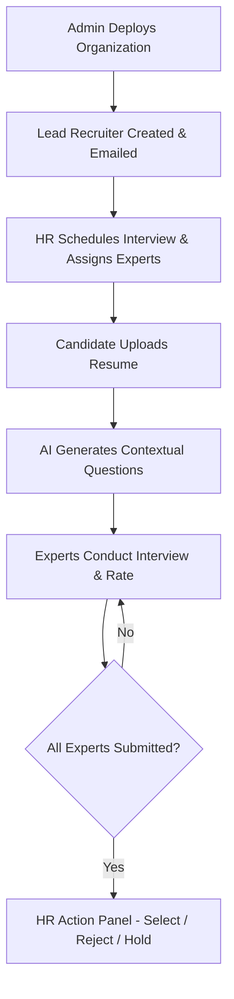

# 🎓 Nexus — AI-Assisted Interview Management Platform

Nexus is an enterprise-style, AI-assisted interview management platform designed to streamline modern hiring workflows. It enables HR coordinators to schedule interviews, assign expert panels, manage candidates, and conduct structured technical evaluations with resume-aware AI assistance.

Built to simulate realistic enterprise interview workflows, Nexus combines collaborative multi-expert assessments, secure role-based access control, AI-powered contextual question generation, and streamlined hiring decision management.

---

# ✨ Core Features

## 🧠 AI Resume-Aware Question Generation
* **Dynamic AI Generation Pipeline**: Uses candidate resume text, job role, experience level, focus areas, and expert specialization to generate contextual interview questions.
* **Resume-aware personalization**: Generates targeted questions based on the candidate's projects, technologies, and claimed experience.
* **Dynamic Interview Categories**: Generates interview sections dynamically tailored to the role difficulty and target level (Intern / Junior / Mid / Senior).


---

## 🏢 Enterprise Org & Recruiter Hierarchy
* **Developer Admin Console (`/dashboard/admin`)**: Platforms developers can perform complete CRUD operations on Organizations, track usage metrics, and monitor recruiter directories.
* **Tiered Recruiter Controls**:
  - **Lead Recruiters**: Can add, edit, or delete standard HR coordinators and experts within their organization.
  - **Standard HRs**: Restructured edit scopes where coordinators can edit only their own profiles.
* **Cascading Organization Renames**: Renaming an organization updates the organization tag for all associated users (HRs, Experts, Candidates) across the database.
* **Recruiter Re-onboarding**: Changing a Lead Recruiter's email deletes the previous recruiter account, creates a new one, and sends temporary credentials via Resend email.

---

## 👥 Multi-Expert Panel Evaluations
* **Independent Expert Evaluations**: Multiple panel experts independently rate candidates, log comments, and record recommendations.
* **Private Evaluation State**: Expert ratings and metrics remain hidden and sanitized server-side until final submission.
* **Automatic Completion Detection**: Automatically moves interview status to `completed` once all assigned panel experts submit their assessments.

---

## 📅 Schedule & Meet Link Integrations
* **Interactive Meeting Shortcuts**: Provides quick buttons with branded icons for **Nexus Meet** and **Google Meet**. Clicking a platform opens its creation portal in a new tab for manual room scheduling.
* **Reactive Refresh Controls**: Live refresh buttons with rotation transitions deployed across dashboard tables for real-time list synchronization.

---

## 🧪 Demo & Reviewer Safe Modes (*For deployed website only*)
* **Secretive Credentials Widget**: Collapsible demo credentials widget embedded at the bottom of the sign-in page with one-click form auto-fill functionality.
* **Read-Only Demo Guard**: Demo recruiter (`john@nexus.com`) is locked to read-only mode on the backend (modifying request methods `POST`, `PUT`, `DELETE`, `PATCH` are blocked).
* **AI Generation Block**: Demo expert (`test@nexus.com` / `text@nexus.com`) is blocked from calling AI generation APIs to preserve API limits.

---

# 🛠 Technology Stack

### Frontend
* Next.js 14 (App Router)
* React
* Tailwind CSS
* NextUI
* React Icons
* Framer Motion

### Backend
* Next.js API Routes (Route Handlers)
* MongoDB (Native Driver)
* JWT Authentication

### AI & Services
* HuggingFace API
* Zod Schema Validation
* Cloudinary (Secure Resume Storage)

---

# 🚀 Getting Started

## Prerequisites
* Node.js (v18+)
* MongoDB Database
* LLM API Key (Google AI Studio)
* Cloudinary Accounts

---

## Environment Variables
Create a `.env.local` file in the root directory and specify:
```env
MONGODB_URI=your_mongodb_connection_string
JWT_SECRET=your_jwt_secret_key

HF_TOKEN=your_hf_token
MODEL_NAME=hf_model
OPENAI_API_BASE='https://router.huggingface.co/v1'
OPENAI_API_KEY=your_openai_api_key (Either of HF_TOKEN or OPENAI_API_KEY will work)

CLOUDINARY_CLOUD_NAME=your_cloudinary_name
CLOUDINARY_API_KEY=your_cloudinary_key
CLOUDINARY_API_SECRET=your_cloudinary_secret

SMTP_HOST=smtp.gmail.com
SMTP_PORT=465
SMTP_SECURE=true
SMTP_USER=your_email
SMTP_PASS=your_password
SMTP_FROM="your_email"
```

---

## Installation & Deployment

1. **Install dependencies**:
   ```bash
   npm install
   ```

2. **Initialize Developer Admin Account**:
   Use the onboarding script to create your first administrative dashboard user:
   ```bash
   node scripts/add-developer.js "Developer Admin" "admin@nexus.com" "securepassword"
   ```
   *Note: Credentials will also be saved locally to `onboarded_credentials.json`.*

3. **Start the development server**:
   ```bash
   npm run dev
   ```

4. **Access the application**: Open `http://localhost:3000` on your browser.

---

# 🔄 System Workflow


