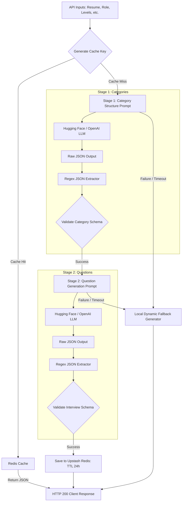
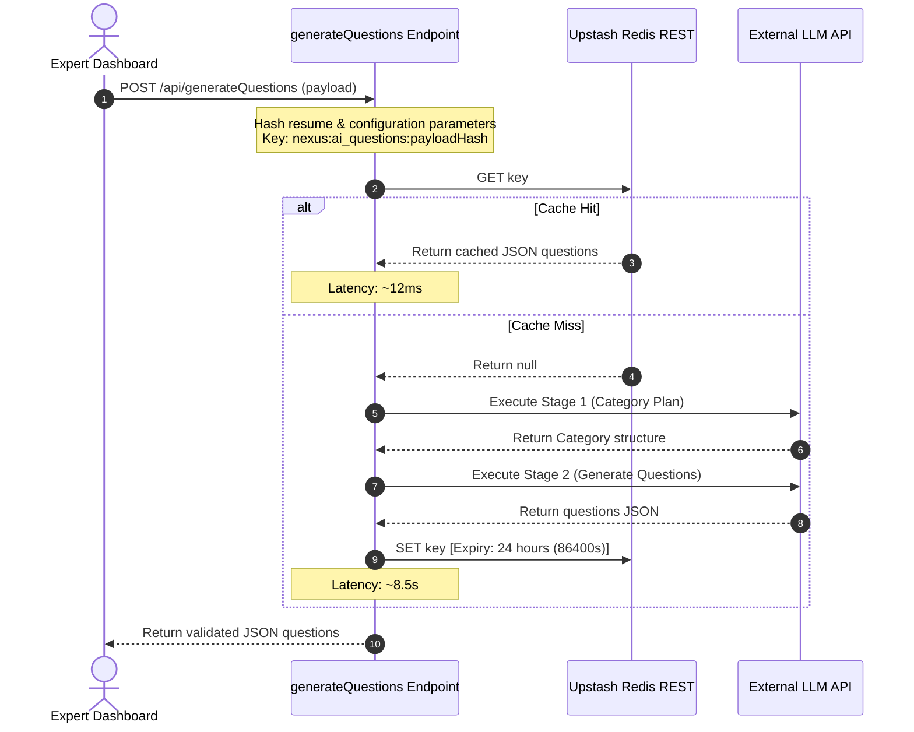

# AI Architecture Document: Dynamic Question Generation Pipeline

## 1. Objective

Nexus utilizes an automated, resume-aware question generation pipeline to solve the core challenges of technical interviewing:
* **Tailored Evaluations**: Standard interviews rely on general, non-personalized questions. Nexus uses LLMs to parse a candidate's resume and generate targeted questions regarding their specific project implementations and trade-off choices.
* **Seniority-Aware Assessments**: The pipeline adjusts testing scopes based on experience tiers, ensuring interns are tested on basic logic and seniors are evaluated on systems design and architecture.
* **Reduced Panel Overhead**: Automating custom questionnaire preparation saves expert interviewers hours of manual design time.

---

## 2. Pipeline Inputs

The pipeline accepts the following configuration parameters at the `/api/generateQuestions` endpoint:

| Input | Description | Source |
| :--- | :--- | :--- |
| **`resumeText`** | Raw text extracted from the candidate's uploaded resume PDF. | Extracted on-the-fly from Cloudinary PDF storage. |
| **`jobRole`** | The targeted engineering title (e.g., *Frontend Engineer*, *DevOps Expert*). | Selected by HR. |
| **`experienceLevel`** | General experience group (e.g., *Junior*, *Mid-Level*, *Senior*). | Selected by HR. |
| **`targetLevel`** | Specific seniority code (e.g., *junior*, *mid*, *senior*). | Selected by HR. |
| **`focusAreas`** | Core technical areas to prioritize (e.g., *React, System Design*). | Selected by HR / Defaults to Job Role. |
| **`expertSpecialization`**| The reviewing expert's specialization (e.g., *Security*, *Databases*). | Pulled from Expert User Profile. |
| **`customPrompt`** | Custom focus rules or specific guidelines. | Inputted dynamically by the scheduling HR. |
| **`questionCount`** | Target number of questions to generate per category. | Configured by HR / Defaults to 3. |

---

## 3. Pipeline Architecture Overview

Nexus separates question generation into a **dual-stage prompting pipeline** managed via **LangChain** and validated using **Zod**. This decoupled workflow ensures high-quality category design before drafting specific questions.



### Process Step Details:
1. **Stage 1 (Category Definition)**: The LLM receives candidate demographics, role details, and custom prompts. It designs exactly 3 to 5 customized interview categories matching the target difficulty. It defines a specific objective for each category.
2. **Stage 2 (Question Generation)**: The pipeline feeds the designed categories along with the candidate's resume back to the LLM. The LLM generates the configured number of personalized, scenario-based questions per category, mapping them back to the resume claims.

---

## 4. Dynamic Category Generation

Categories vary dynamically by seniority. The pipeline prevents generic categories (like "General Programming") and replaces them with tailored, domain-specific titles.

### Tiers & Difficulty Mapping:
* **Intern**: Focuses on core logic, basic data structures, OOP/FP concepts, and language syntax.
* **Junior**: Emphasizes standard API handling, framework features (e.g., React Hooks, Node middleware), and basic Git/CI flows.
* **Mid-Level**: Inspects concurrency, database queries, resource profiling, code optimization, and interface contracts.
* **Senior**: Investigates distributed systems, consistent hashing, caching consistency, microservice architecture, trade-off decisions, and scalability bottlenecks.

### Structural Comparison Example:
If the input role is **Fullstack Engineer**, the pipeline designs different categories based on seniority:

````carousel
Junior Profile
```json
[
  {
    "category": "API Operations",
    "objective": "Assess REST contracts, HTTP status code utilization, and error boundaries.",
    "difficulty": "Junior"
  },
  {
    "category": "React State Management",
    "objective": "Evaluate understanding of component lifecycle, hook dependencies, and context API.",
    "difficulty": "Junior"
  }
]
```
<!-- slide -->
Senior Profile
```json
[
  {
    "category": "Distributed Systems scaling",
    "objective": "Evaluate partitioning strategies, consistent hashing, and database sharding patterns.",
    "difficulty": "Senior"
  },
  {
    "category": "Caching Consistency",
    "objective": "Assess cache-aside patterns, write-through trade-offs, and stampede mitigation.",
    "difficulty": "Senior"
  }
]
```
````

---

## 5. Question Generation Strategy

To elevate the technical rigor of evaluations, the pipeline enforces strict guidelines during question drafting:

* **Resume Awareness**: Questions deep-dive into the candidate's claimed experience. For example, if a resume claims *"Migrated SQL databases to Cassandra for horizontal scaling"*, the LLM bypasses general SQL questions and asks: *"Walk through the partitioning strategy you chose when migrating to Cassandra, and how you handled hot keys under high write load."*
* **Skill Validation**: Evaluates actual capabilities instead of textbook definitions (e.g., avoiding *"What is polymorphism?"* in favor of *"Describe a situation where you refactored an interface to utilize dynamic dispatch, and the design pattern trade-offs involved."*).
* **Scenario Questions**: Introduces a realistic scenario. For instance: *"Your team deploys a WebSocket-based chat service, and CPU usage spikes to 95% on connection retries. What profiling checkpoints would you set up to trace the lock thread?"*
* **Practical Questions**: Tests code refactoring, complexity analysis, and performance optimization choices.

---

## 6. Output Schema

The final output is validated against a nested Zod schema (`interviewStructureSchema`) before being returned to the caller.

### Example Validated Response Output:
```json
{
  "interviewStructure": [
    {
      "category": "System Design",
      "objective": "Evaluate design of highly available, consistent distributed cache networks.",
      "difficulty": "Senior",
      "questions": [
        "Explain how you would prevent cache stampede (thundering herd) on a high-throughput product page during a flash sale.",
        "Compare the efficiency of a consistent hashing ring against static modulo sharding when scaling out from 3 to 10 Redis nodes."
      ]
    },
    {
      "category": "Concurrency & Memory",
      "objective": "Assess multithreading safety and runtime memory optimization.",
      "difficulty": "Senior",
      "questions": [
        "How would you locate and debug a memory leak caused by uncleaned event listeners inside a long-running Node.js process?",
        "Explain the performance tradeoffs between mutex locks and optimistic concurrency control under a write-heavy database transaction profile."
      ]
    }
  ]
}
```

---

## 7. Redis Caching Layer

Because the two-stage LLM generation pipeline relies on sequential network calls to external LLMs, it suffers from latency (typically 5 to 15 seconds) and token costs. 

### A. Cache Key Generation Strategy
To handle candidate resumes (which can be very large) efficiently as keys, Nexus uses a deterministic hashing strategy:
1. Extract and trim the candidate's resume text.
2. Hash the resume text using **SHA-256** to generate a static 64-character hash value.
3. Combine the resume hash with all request configuration parameters (role, level, counts, specialization, prompts) into a single payload object.
4. Hash the combined payload object using **SHA-256** to generate the final key: `nexus:ai_questions:${payloadHash}`.

### B. Sequence Flow (Cache Hit vs. Miss)


---

## 8. Failure Handling & Failsafes

To ensure high availability in production, the pipeline implements fallback logic at each point of failure.

### A. Malformed LLM Outputs
* **Problem**: LLMs occasionally wrap JSON responses in markdown blocks (e.g., ` ```json ... ``` `) or append conversational text.
* **Failsafe**: Nexus parses raw output using `parseJSONOutput()`, which strips markdown fences and extracts raw JSON arrays or objects via regular expression matching: `/[\{\[][\s\S]*[\}\]]/`.

### B. Zod Validation Exceptions
* **Problem**: The output JSON fails the structural Zod parser check (e.g., missing questions array or wrong property names).
* **Failsafe**: Any Zod validation exception throws an error, which is caught by the parent block and triggers the local fallback generator.

### C. LLM Down time, Empty Resumes, or Network Timeout
* **Problem**: The external LLM is offline, credentials fail, or the resume PDF contains no text.
* **Failsafe**:
  * **No Resume**: Handled by passing a placeholder text string instructing the model to generate industry-standard questions matching the target role/level parameters.
  * **LLM Failure**: If any error or network timeout occurs during Stage 1 or Stage 2, the `catch` block catches the exception and executes `getFallbackQuestions()`. This generates localized, role-relevant questions matching the exact categories and difficulty specifications locally in milliseconds, preventing the client request from failing.
