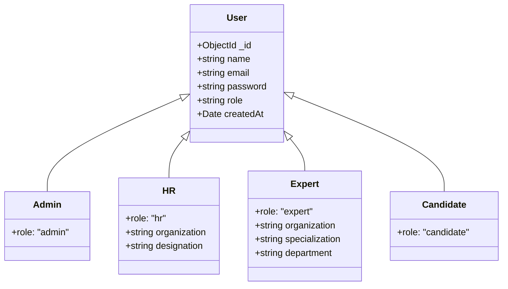
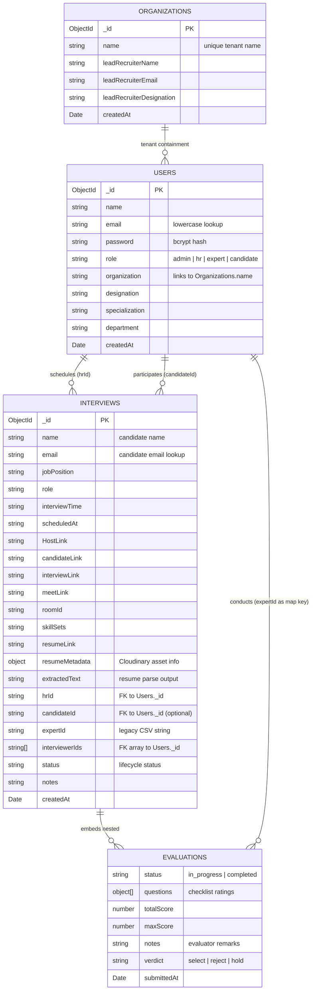
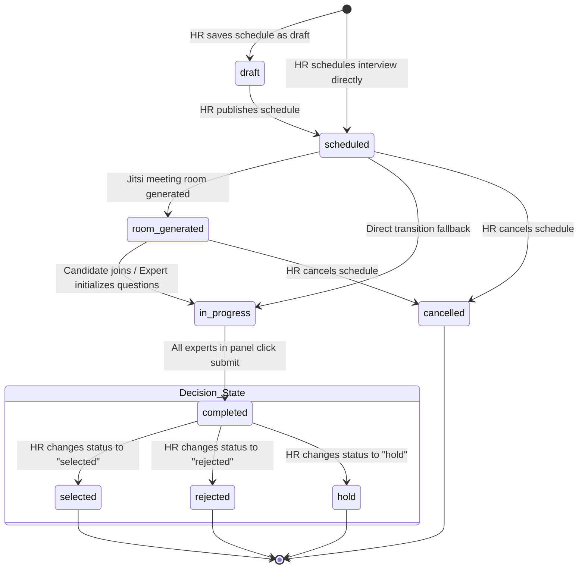

# Database Design Document: Nexus

This document details the database architecture, schema structures, relationships, and indexing strategies implemented in the Nexus AI-Assisted Interview Management Platform. 

---

## 1. Database Overview

Nexus utilizes **MongoDB** as its primary transactional database. A document-oriented NoSQL database was chosen due to the highly dynamic and unstructured nature of candidate profiles, resume extraction text, and arbitrary evaluation checklists:
* **Flexible Schemas**: Different job positions require different interview questions and skill verification criteria.
* **Nested Collections**: Expert evaluation ratings, summary remarks, and submission states are stored atomically inside their respective interview documents rather than in a separate table, preventing unnecessary relational joins.
* **Serverless Connection Caching**: Because Nexus is deployed on a serverless Next.js architecture, MongoDB connections are cached in a global variable (`global._mongoClientPromise`) to prevent database socket exhaustion during high concurrency.

Additionally, **Upstash Redis** is deployed as a low-latency caching and rate-limiting layer:
* **Distributed Rate Limiting**: Enforces API protection (e.g., login, signup, resume uploads) across stateless serverless instances with the prefix `@nexus/ratelimit`.
* **AI Cache Layer**: Stores resume-aware generated questions under `nexus:ai_questions:${payloadHash}` to eliminate redundant LLM calls and reduce external API latency.

---

## 2. Collections

The MongoDB database consists of three primary collection namespaces, alongside one operational collection for security lifecycle events:

| Collection Name | Storage Scope | Relationships & Key Attributes |
| :--- | :--- | :--- |
| **`users`** | Contains credentials and profiles for all system actors (Admins, HRs, Experts, and Candidates). | Linked to organizations via the `organization` name string. |
| **`interviews`** | Tracks scheduled sessions, candidate details, room Jitsi configurations, and resume links. | Parent document containing nested **`evaluations`**. Linked to HR via `hrId` and Candidates via `email` or `candidateId`. |
| **`organizations`** | Configures tenant companies registered on the platform and assigns lead recruiters. | Linked to HR users by matching the company name. |
| **`password_resets`** | Temporary collection storing verification tokens for forgotten password cycles. | Configures a TTL index on `expiresAt` for automatic document expiration. |

### Note on the Evaluation Model
The **`evaluations`** model is **not** a standalone collection. It is embedded directly as a nested key-value map inside the `interviews` collection under the `evaluations` property:
```json
{
  "_id": "60d5f15b3c5a3b2b4c8d9e10",
  "name": "Jane Doe",
  "evaluations": {
    "60d5f15b3c5a3b2b4c8d9e01": {
      "status": "completed",
      "questions": [...],
      "totalScore": 12,
      "maxScore": 15,
      "notes": "Excellent design skills.",
      "verdict": "select",
      "submittedAt": "2026-06-21T15:00:00.000Z"
    }
  }
}
```
* **Rationale**: This guarantees atomic updates when an expert submits feedback, prevents orphan evaluation records, and aligns with MongoDB's document encapsulation principles.

---

## 3. User Model

The `users` collection stores user documents. A single collection accommodates all actors, distinguished by their `role` field.

### Field Definitions

* **`_id`** (`ObjectId`): MongoDB primary key.
* **`name`** (`string`): The user's display name.
* **`email`** (`string`): Hashed lookup key, stored in **lowercase** to prevent duplicate accounts with varying casing.
* **`password`** (`string`): Hashed password using `bcrypt` (10 rounds).
* **`role`** (`string`): Enum representing system scopes: `'admin'`, `'hr'`, `'expert'`, or `'candidate'`.
* **`organization`** (`string`, optional): Inherited company name. Present for `'hr'` and `'expert'` roles to enforce tenant partitioning.
* **`designation`** (`string`, optional): Professional title (e.g., `'Lead Recruiter'`, `'Talent Acquisition Specialist'`).
* **`specialization` / `department`** (`string`, optional): Present on `'expert'` documents to assist HR during panel assignment (e.g., `'Distributed Systems'`, `'Frontend'`).
* **`createdAt`** (`Date`): Timestamp when the profile was generated.

### Role Schemas & Relationships



1. **Developer Admin (`role: 'admin'`)**
   * **Attributes**: `_id`, `name`, `email`, `password`, `role`, `createdAt`.
   * **Relationships**: Global scope. Not bound to any single organization.
2. **Lead Recruiter (`role: 'hr'`)**
   * **Attributes**: Same as standard HR but has `designation: 'Lead Recruiter'`.
   * **Relationships**: Administrative owner of a company profile in the `organizations` collection. Authorized to manage other HR accounts under the same `organization` value.
3. **HR Coordinator (`role: 'hr'`)**
   * **Attributes**: `_id`, `name`, `email`, `password`, `role`, `organization`, `designation`, `createdAt`.
   * **Relationships**: Bound to an `organization`. Creates and updates interview records. Can only view and manage resources sharing their exact `organization` tag.
4. **Expert Panelist (`role: 'expert'`)**
   * **Attributes**: `_id`, `name`, `email`, `password`, `role`, `organization`, `specialization`, `department`, `createdAt`.
   * **Relationships**: Created by an HR manager of their company. Inherits the HR creator's `organization`. Assigned to interviews via the interview's `interviewerIds` array.
5. **Candidate (`role: 'candidate'`)**
   * **Attributes**: `_id`, `name`, `email`, `password`, `role`, `createdAt`.
   * **Relationships**: Registered independently. Correlated with Scheduled Interviews by matching their `email` address.

---

## 4. Interview Model

The `interviews` collection represents the core transaction entity in the Nexus application. It contains scheduling details, candidate records, Jitsi meeting links, resume links, and the nested expert evaluations.

### Schema Attributes

```json
{
  "_id": { "$oid": "60d5f15b3c5a3b2b4c8d9e20" },
  "name": "Jane Doe",
  "email": "jane.doe@example.com",
  "jobPosition": "Senior Fullstack Engineer",
  "role": "Senior Fullstack Engineer",
  "interviewTime": "2026-06-25T10:00:00.000Z",
  "scheduledAt": "2026-06-25T10:00:00.000Z",
  "HostLink": "https://meet.jit.si/nexus-room-123",
  "candidateLink": "https://meet.jit.si/nexus-room-123",
  "interviewLink": "http://localhost:3000/can?id=60d5f15b3c5a3b2b4c8d9e20",
  "meetLink": "https://meet.jit.si/nexus-room-123",
  "roomId": "nexus-room-123",
  "skillSets": "React, Node.js, AWS, MongoDB",
  "resumeLink": "https://res.cloudinary.com/.../resume.pdf",
  "resumeMetadata": {
    "public_id": "resumes/jane_doe_hash",
    "secure_url": "https://res.cloudinary.com/.../resume.pdf",
    "format": "pdf"
  },
  "extractedText": "Jane Doe Software Architect... Experience at Acme Corp...",
  "hrId": "60d5f15b3c5a3b2b4c8d9e01",
  "candidateId": "60d5f15b3c5a3b2b4c8d9e05",
  "expertId": "60d5f15b3c5a3b2b4c8d9e02,60d5f15b3c5a3b2b4c8d9e03",
  "interviewerIds": ["60d5f15b3c5a3b2b4c8d9e02", "60d5f15b3c5a3b2b4c8d9e03"],
  "status": "scheduled",
  "notes": "Ensure you verify system design skills.",
  "evaluations": {},
  "createdAt": { "$date": "2026-06-21T15:26:00.000Z" }
}
```

### Key Fields & Relationships

* **Identity Fields**:
  * **`name`** / **`email`**: Direct candidate strings. Used to reference candidate identifiers before they build platform accounts.
  * **`hrId`** (`string`): The user ID of the HR manager who created the schedule.
  * **`candidateId`** (`string` or `null`): The user ID of the candidate once onboarded.
  * **`interviewerIds`** (`array of strings`): The primary panel record. List of expert IDs assigned to the interview.
  * **`expertId`** (`string`): Comma-separated list of expert IDs (retained for legacy integration compatibility, synched automatically with `interviewerIds`).
* **Synchronized Schema Synonyms**:
  To guarantee backward compatibility across legacy UI pages and modern API layers, the server automatically updates and matches the following pairs:
  * **`jobPosition`** ↔ **`role`**: Job position name (e.g., `'Mid-Level Backend Developer'`).
  * **`interviewTime`** ↔ **`scheduledAt`**: Interview scheduled datetime string.
  * **`HostLink`** / **`candidateLink`** ↔ **`meetLink`**: Jitsi video conference endpoints.
* **Resume & AI Context**:
  * **`resumeLink`** (`string`): Cloudinary secure HTTPS URL to the uploaded resume.
  * **`resumeMetadata`** (`object`): Structured metadata payload returned by the Cloudinary SDK, containing the unique `public_id` used for resource deletions.
  * **`extractedText`** (`string`): Raw text extracted from the PDF resume via parser utilities, used as context for prompt injections in AI questions.
* **State & Feedback Fields**:
  * **`status`** (`string`): Lifecycle indicator.
  * **`notes`** (`string`): Coordinator instructions visible to panelists.
  * **`evaluations`** (`object`): Embedded evaluator-keyed map.

---

## 5. Evaluation Model

The evaluation schema defines the feedback structure. Each assigned expert from `interviewerIds` saves their ratings and verdicts under their own account identifier: `evaluations.${expertId}`.

### Properties of an Expert Evaluation

* **`status`** (`string`): Tracks the state of the individual evaluation. Can be:
  * `'in_progress'`: Expert is rating questions but has not submitted.
  * `'completed'`: Evaluation finalized. Freezes inputs.
* **`questions`** (`array of objects`): Structured assessment checklist. Each question contains:
  * `key` (`number`): Position index.
  * `question` (`string`): Text prompt (either AI-generated or custom-added).
  * `rating` (`number`): The score awarded (integer from `1` to `5`).
* **`totalScore`** (`number`): Sum of the scores of all questions in the checklist.
* **`maxScore`** (`number`): Maximum points achievable (`questions.length * 5`).
* **`notes`** (`string`): Summary textual remarks and evaluation comments.
* **`verdict`** (`string`): Evaluator hiring recommendation (enum: `'select'`, `'reject'`, or `'hold'`).
* **`submittedAt`** (`Date`): Timestamp recorded when the expert submits the evaluation.

### Panel Aggregation logic
When all assigned experts submit their evaluations (i.e. all IDs in `interviewerIds` have status `'completed'` under `evaluations`), the system performs post-update aggregation:
1. Automatically sets the interview's overall status to `'completed'`.
2. Computes the overall `totalScore` and `maxScore` as averages of all submitted evaluations.

### Double-Blind Assessment Security
To prevent collaborative bias, evaluations are structured individually. The `GET /api/interviews/get` endpoint hides the `evaluations` list and `evaluationsBreakdown` from any active panelist who has **not** yet set their own status to `'completed'`. Once they submit, they gain access to view their peers' feedback.

---

## 6. Entity Relationships

The entity relationship diagram highlights how tenant organizations partition users, how those users schedule and conduct interviews, and how evaluations are encapsulated directly inside the interview document.



---

## 7. Interview State Machine

The candidate interview lifecycle is managed through explicit status changes. State transitions are authorized based on user roles.



### Transition Authority Rules

* **Draft & Scheduling**: HR owns the transitions between `draft`, `scheduled`, `room_generated`, and `cancelled`.
* **Interview Process**: When experts initialize questionnaires or input manual grading, the status shifts to `in_progress`.
* **Submissions**: The transition to `completed` is automated. When a panel expert submits, the API checks if `evaluations[id].status === 'completed'` for all assigned `interviewerIds`. If true, the parent interview status updates to `'completed'`.
* **Hiring Verdicts**: Only HR roles (`hr`) are permitted to transition a completed interview to final outcome states (`selected`, `rejected`, or `'hold'`). Experts are blocked from modifying these terminal states.
* **Database State Representation**: The database stores the state "On Hold" as `'hold'` in the status field, which the UI renders as "Hold" or "On Hold".

---

## 8. Indexing Strategy

To maintain performance as interview count, tenant profiles, and user directories scale, the database utilizes strategic indexes.

### A. Email Lookups
Authentication pathways and candidate dashboard routing rely heavily on email queries:
* **User Accounts**: Login operations search the `users` collection by email.
  * *Recommended Index*: `db.collection('users').createIndex({ email: 1 }, { unique: true })`
  * *Impact*: Ensures instantaneous logins and guarantees email uniqueness at the database level.
* **Candidate Schedules**: The candidate portal queries schedules where candidate email matches the session.
  * *Recommended Index*: `db.collection('interviews').createIndex({ email: 1 })`
  * *Impact*: Speeds up dashboard loading for candidates.

### B. Interview Lookups
Retrieving specific records, upcoming schedules, or past history:
* **Single Session Fetch**: Routing by ID uses the primary key index.
  * *Default Index*: `{ _id: 1 }` (automatically configured by MongoDB).
* **Expert Rosters**: Upcoming and history tables filter on the expert panelist's ID.
  * *Query Example*: `{ status: { $in: [...] }, $or: [{ expertId: id }, { expertId: { $regex: id } }] }`
  * *Recommended Compound Index*: `db.collection('interviews').createIndex({ interviewerIds: 1, status: 1 })`
  * *Impact*: Accelerates dashboard queries for expert users by preventing full-collection scans on array searches.
* **HR Auditing**: HR queries list of interviews coordinated by their team members.
  * *Recommended Index*: `db.collection('interviews').createIndex({ hrId: 1 })`
  * *Impact*: Optimizes company schedule list rendering.

### C. Tenant Organization Lookups
Enforces isolation borders between different companies:
* **User Rosters**: Verifying experts or HR members in the same workspace.
  * *Query Example*: `find({ organization: /Acme/i })`
  * *Recommended Index*: `db.collection('users').createIndex({ organization: 1 })`
  * *Impact*: Accelerates user management table rendering.
* **Organization Profiles**:
  * *Recommended Index*: `db.collection('organizations').createIndex({ name: 1 }, { unique: true })`
  * *Impact*: Guarantees single-tenant name configuration.

### D. Security TTL (Time-To-Live) Indexes
* **Password Resets**: Temporary collection for password links.
  * *Implemented Index*: `db.collection('password_resets').createIndex({ expiresAt: 1 }, { expireAfterSeconds: 0 })`
  * *Impact*: Automatically purges expired password reset tokens, preventing database bloat and minimizing authorization reuse windows.
