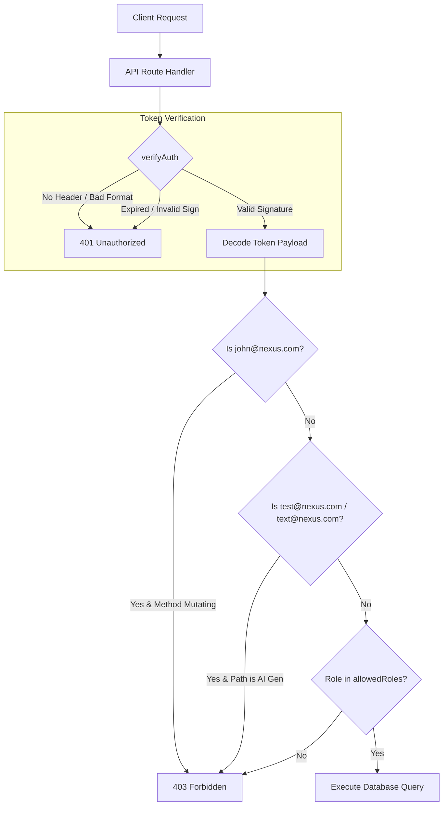
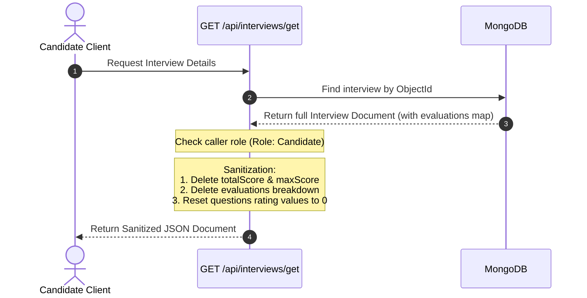

# Security and RBAC Design Document: Nexus

This document defines the security architecture, role authorization structure, API validation constraints, and known safety limitations implemented in the Nexus platform.

---

## 1. Security Goals

* **Endpoint Integrity**: Prevent unauthorized users from modifying system records (e.g., candidates changing their schedules, standard HRs managing other organizations).
* **Double-Blind Evaluation Protection**: Isolate ratings and comments submitted by expert panel members to ensure independent feedback.
* **Sensitive Data Sanitization**: Prevent candidate accounts from retrieving interview feedback scores, verdicts, and expert comments.
* **Input Validation**: Strictly filter and validate uploaded files and payload schemas at the application boundaries before writing to database collections.

---

## 2. User Roles

Nexus implements four core user roles verified via JWT scopes, plus administrative hierarchies.

* **Developer Admin**: System-level administrator. Deploys organizations, manages organizational directories, and monitors global statistics.
* **Lead Recruiter** (`hr` with organization ownership): Operates as the administrative owner of an organization. Can create, edit, or delete standard HR coordinators and panel experts inside their organization.
* **HR Coordinator** (`hr` standard): Schedules candidate interviews, assigns panels, manages candidates, and selects final verdicts (`selected`, `rejected`, `on_hold`). Restricted from deleting or modifying other HR profiles in the organization.
* **Expert Panelist** (`expert`): Conducts technical interviews, accesses resume summaries, generates custom AI questions, and records scores/notes. Restricted from changing final candidate outcomes.
* **Candidate** (`candidate`): Accesses the platform to upload their resume, update current skills, and read their basic interview details. Restricted from seeing any scoring metrics or evaluator listings.

---

## 3. Permission Matrix

The table below outlines the authorized actions across user roles:

| Action | Developer Admin | Lead Recruiter | HR Coordinator | Expert Panelist | Candidate |
| :--- | :---: | :---: | :---: | :---: | :---: |
| **Manage Organizations** | ✔ | ❌ | ❌ | ❌ | ❌ |
| **Create HR/Expert Accounts** | ✔ | ✔ | ❌ | ❌ | ❌ |
| **Manage HR (Delete/Update)** | ✔ | ✔ | ❌ (Own Profile Only) | ❌ | ❌ |
| **Schedule Interviews** | ❌ | ✔ | ✔ | ❌ | ❌ |
| **Update Interviews (Metadata)**| ❌ | ✔ | ✔ | ❌ | ❌ |
| **Submit Evaluation Scores** | ❌ | ❌ | ❌ | ✔ | ❌ |
| **Set Final Hiring Verdict** | ❌ | ✔ | ✔ | ❌ | ❌ |
| **Upload Resume PDF** | ❌ | ❌ | ❌ | ❌ | ✔ |
| **View Evaluations Summary** | ❌ | ✔ | ✔ | ✔ | ❌ |
| **View Raw JWT Token** | ✔ | ✔ | ✔ | ✔ | ✔ |

---

## 4. Route Protection Strategy

Endpoint security is enforced in Next.js Serverless API Route Handlers using a helper verification sequence (`verifyAuth`) rather than a global middleware hook, allowing selective validation bypass (e.g., public sign-in routes).

### A. JWT Authentication and Decode
The utility `verifyAuth(req, allowedRoles)` handles incoming request verification:
1. Extracts the `Authorization` header and asserts the `Bearer <token>` format.
2. Verifies the signature using `jsonwebtoken` against the server secret key (`JWT_SECRET`).
3. Decodes user identifier (`_id`), email, name, and role.

### B. Demo Safe Modes (Production Hardening)
To prevent public reviewer accounts from altering data, custom verification checks block write methods:
* **Demo Recruiter Guard**: If the decoded email is `john@nexus.com`, any mutating request methods (`POST`, `PUT`, `DELETE`, `PATCH`) return a `403 Forbidden` response.
* **Demo Expert Guard**: If the decoded email is `test@nexus.com` or `text@nexus.com`, access to `/api/generatequestion` or `/api/generatequestions` is blocked with a `403 Forbidden` response, protecting model API token quotas.

### C. Token Revocation & Blacklisting (Distributed State)
To prevent compromised tokens from remaining active for their full 15-day lifespan, Nexus implements a serverless-optimized token revocation pipeline:
* **Global Middleware Interceptor**: A global Next.js `middleware.js` file filters incoming requests to `/api/*` (except public endpoints). It queries Upstash Redis REST for keys matched to the incoming token signature (`blacklist:${token}`). If a match exists, it rejects the request instantly with a `401 Unauthorized` response before invoking the route handler.
* **Logout Endpoint**: Posting to `/api/auth/logout` decodes the token's JWT expiration (`exp`) and saves the token to Redis with a TTL set to its exact remaining lifespan.
* **Force Session Invalidation**: Changing a password via `/api/auth/change-password` automatically blacklists the current session token in Redis, forcing the user to log in again.

---

## 5. Candidate Data Protection

Nexus sanitizes database records before returning them to client agents to prevent information leakage.

### Sanitization Implementation:
When a candidate requests their interview details via `/api/interviews/get`:
* The backend deletes `totalScore`, `maxScore`, and the `evaluations` mapping.
* The backend strips the `evaluationsBreakdown` array entirely.
* Each element in the `questions` array has its `rating` property reset to `0`, hiding interviewer feedback comments and scores.

### Panelist Double-Blind Masking:
To guarantee independent assessments, panel experts who have NOT yet completed their evaluation are prevented from seeing the scores or comments of other experts:
* If the caller is an `expert` and their private evaluation status is not `completed`, the `/api/interviews/get` endpoint strips the `evaluationsBreakdown` array, deletes the overall average `totalScore` and `maxScore`, and removes the raw `evaluations` map from the JSON response.
* Once the expert submits their feedback (marking their status as `completed`), these values become visible, facilitating collaborative review.

---

## 6. Resume Security

The resume file validator (`services/resume/validateResume.js`) filters file uploads at the API boundary before passing the stream to Cloudinary storage.

* **File Size Validation**: The file size is verified to be under **2MB** (`maxFileSize = 2 * 1024 * 1024` bytes). Any file exceeding this limit is rejected with a `400 Bad Request` response.
* **MIME Validation**: Checks the file MIME type against allowed headers:
  * `application/pdf`
  * `application/msword`
  * `application/vnd.openxmlformats-officedocument.wordprocessingml.document` (DOCX)
* **Extension Validation**: As an additional fallback, the validator asserts that the filename ends with one of the allowed extensions: `.pdf`, `.doc`, or `.docx`.
* **Binary Magic Bytes Validation**: Inspects the first 8 bytes of the file stream to assert file signatures matching PDF (`%PDF-`), DOCX (`PK..`), or DOC legacy formats, preventing renamed executable script upload bypasses.

---
