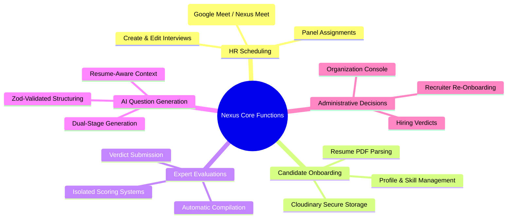
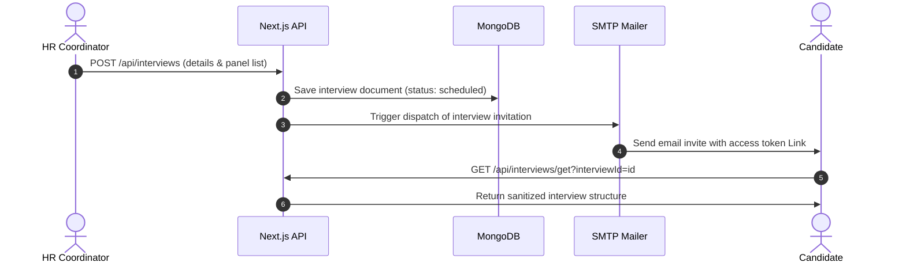
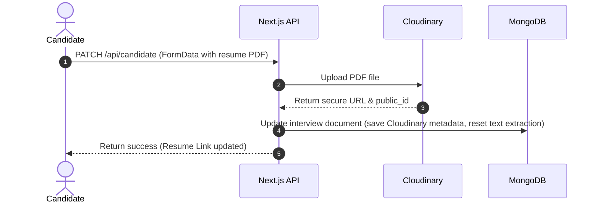
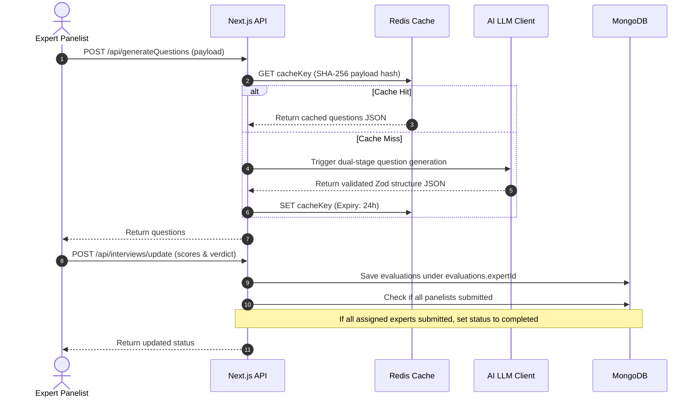
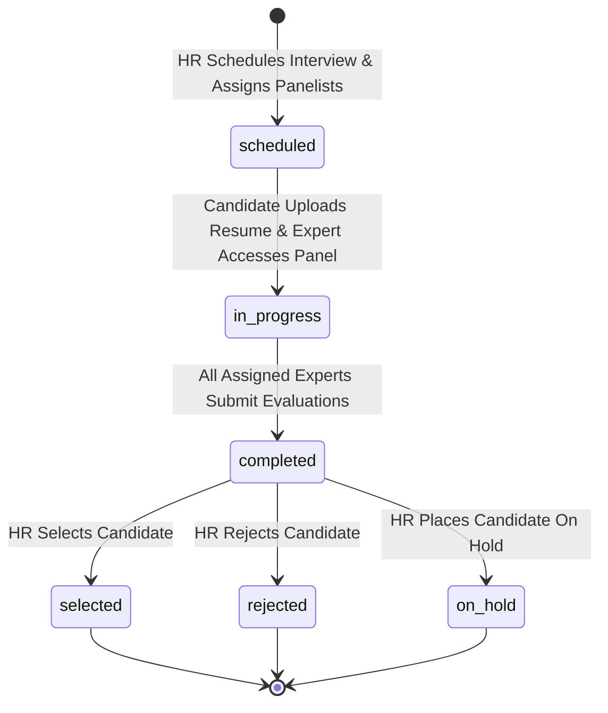

# System Design Document: Nexus

## 1. Problem Statement

Traditional corporate recruitment workflows are plagued by operational inefficiencies, coordination bottlenecks, and evaluation biases. Nexus is an enterprise-style, AI-assisted interview management platform designed to address these pain points.

### Challenges in Traditional Workflows
* **Manual Interview Design**: Preparing role-specific, candidate-tailored technical evaluations is time-consuming and often lacks depth. Interviewers frequently resort to generic internet trivia rather than assessing the candidate's actual projects and experience.
* **Coordination Overload**: Scheduling, panel assignment, resume parsing, and email communication require manual oversight across disjointed tools.
* **Evaluation Bias & Collaboration Gaps**: Panel experts often influence each other's opinions if evaluations are shared immediately, or reviews are lost in unstructured chat channels. 
* **Operational Scaling**: Maintaining low-latency, secure services during seasonal hiring spikes strains traditional monolithic web servers.

### Why Nexus Exists
Nexus centralizes the entire hiring pipeline into a single, secure, and scalable web application. It integrates AI resume parsing, dynamic question generation, independent double-blind evaluation panels, and automated communication. By doing so, it raises evaluation quality while reducing administrative overhead.

---

## 2. Functional Requirements

* **HR Scheduling**: HR coordinators can schedule interviews, assign candidate details, define targeted job roles/experience levels, and select an expert panel (interviewer IDs). It integrates interactive platform shortcuts for **Google Meet** and **Nexus Meet**.
* **Candidate Onboarding**: Candidates receive automated invitations containing magic links. They can securely upload their resumes in PDF format, specify current skill sets, and prepare for evaluation.
* **Expert Evaluations**: Assigned experts access a tailored dashboard displaying the candidate's resume metadata and custom questions. Experts rate responses independently, with their individual feedback, scores, and verdicts stored under private key-value paths (keyed by `expertId`) in the interview document. The system compiles the evaluations and automatically marks the interview status as `completed` once all assigned panel experts have submitted their feedback.
* **AI Question Generation**: Utilizes an AI generation pipeline that processes candidate resume text, target role difficulty, focus areas, and expert specialization. The pipeline runs a two-stage prompt structure to design section categories and generate contextual, resume-aware questions.
* **Administrative Decisions**: Platform administrators can run organization-wide CRUD operations, manage recuited profiles, track overall platform usage metrics, and execute cascading updates (e.g., propagating organization renames across users and interviews).

---

## 3. Non-Functional Requirements

* **Scalability**: 
  * The frontend and API routes must run on serverless cloud containers (e.g., Vercel) that auto-scale horizontally with traffic.
  * Database connections are managed via a cached connection promise client to prevent connection exhaustion.
  * Rate-limiting and question caching must be distributed via a stateless REST Redis cluster (Upstash) to survive serverless execution cycles.
* **Security**:
  * **Role-Based Access Control (RBAC)**: Strict role-based middleware guards endpoints (`candidate`, `expert`, `hr`, `admin`).
  * **Demo Safe Modes**: Demo accounts (e.g., reviewers/demo recruiters) must be locked to read-only states in production by blocking mutation request methods (`POST`, `PUT`, `DELETE`, `PATCH`). 
  * **Data Isolation**: Raw evaluations are sanitized server-side before being returned to clients to ensure double-blind integrity.
* **Performance**:
  * Page render times must be optimized with Next.js dynamic routing and conditional caching.
  * Highly expensive LLM question generation pipelines (which take 5–15 seconds) must be cached under deterministic keys (SHA-256 payload hashes) in Redis, returning cached structures in under **15ms**.
* **Maintainability**:
  * Decoupled validation boundary layers using **Zod schemas** to validate incoming client payloads before entering the business logic.

---

## 4. High-Level Architecture

Nexus utilizes a modern, serverless architecture that separates the presentation layer, business logic APIs, data layer, caching layer, and third-party integrations.

### Component Details:
1. **Presentation Layer**: Built on Next.js 14 App Router, NextUI, and Tailwind CSS. State handling is managed reactively, updating components via unified REST requests.
2. **Compute / API Layer**: Stateless Next.js route handlers process core mutations, fetch operations, and authentication.
3. **Database Layer**: MongoDB stores user credentials, organizations, and interview metadata. Connection pools are cached globally in development to prevent connection leaks.
4. **Caching & Coordination Layer**: Upstash Redis manages IP rate-limiting counters globally (preventing API route scraping) and caches computationally expensive AI questions using a SHA-256 payload hashing algorithm.
5. **Third-Party Services**:
   * **Cloudinary**: Directly ingests and serves candidate resume PDFs.
   * **Hugging Face / Gemini**: Powers the resume-aware question generation pipeline.
   * **SMTP**: Nodemailer dispatches secure onboarding credentials and interview invites.

---

## 5. Core User Flows

### A. HR Scheduling & Onboarding Flow

### B. Candidate Resume & Skill Registration Flow

### C. Expert Dynamic Evaluation Flow

---

## 6. Interview Lifecycle States

The status of an interview progresses linearly from scheduling to hiring decisions. The state machine enforces permissions and controls the visibility of evaluation summaries based on these states.

* **scheduled**: The interview has been created. A candidate link and expert dashboard are generated, but evaluations cannot be recorded yet.
* **in_progress**: The candidate has uploaded a resume, and experts are conducting the live interview. Rating states are initialized and can be edited privately.
* **completed**: Automatically triggered when every interviewer listed in `interviewerIds` has submitted their evaluation. At this stage, candidate overall scores are calculated from panel averages, and the final decision dashboard becomes available to HR.
* **selected / rejected / on_hold**: Closed terminal states decided by the HR coordinator after analyzing the panel's aggregated evaluations.

---

## 7. Major Design Decisions

| Technology | Purpose | Rationale | Alternatives Considered |
| :--- | :--- | :--- | :--- |
| **Next.js 14 (App Router)** | Core Web Framework | Simplifies project structure by uniting client-side routing with serverless API route handlers. Provides server-side rendering (SSR) benefits for faster page load times and dynamic API performance. | Express.js backend + React SPA frontend (Requires managing two servers and CORS headers). |
| **MongoDB** | Primary Database | The unstructured nature of candidate profiles, dynamic question categories, and arbitrary evaluation shapes (maps of variable expert feedback) fits naturally into MongoDB's document model. Fast, connection-cached native drivers provide excellent scalability. | PostgreSQL (Requires rigid schemas and complex JSONB joins for arbitrary expert comments/question lists). |
| **Upstash Redis** | Caching & Rate Limiting | Traditional TCP Redis clients exhaust connection limits in serverless lambdas. Upstash operates over stateless HTTP REST, maintaining speed under high concurrency. Enables distributed rate-limiting and cost-effective AI question caching. | In-memory cache map (Lacks sync across lambdas; reset on serverless execution freeze). |
| **Cloudinary** | Resume PDF Storage | Ingests and stores candidate documents off-server. Handles secure PDF uploads and transforms static resources, offering a high-performance Edge CDN out of the box. | Local storage or raw MongoDB GridFS (Bloats database size, strains server bandwidth). |
| **LangChain** | AI Pipeline Orchestration | Simplifies LLM integration by abstracting prompts into templates, supporting automated request retry controls, and translating output schemas directly into Zod validation checks. | Direct REST calls to Hugging Face APIs (Requires writing verbose retry loops and manual JSON extraction scripts). |
